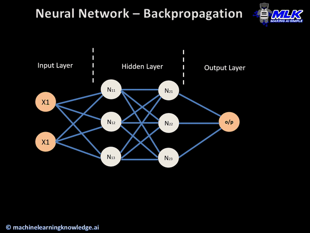
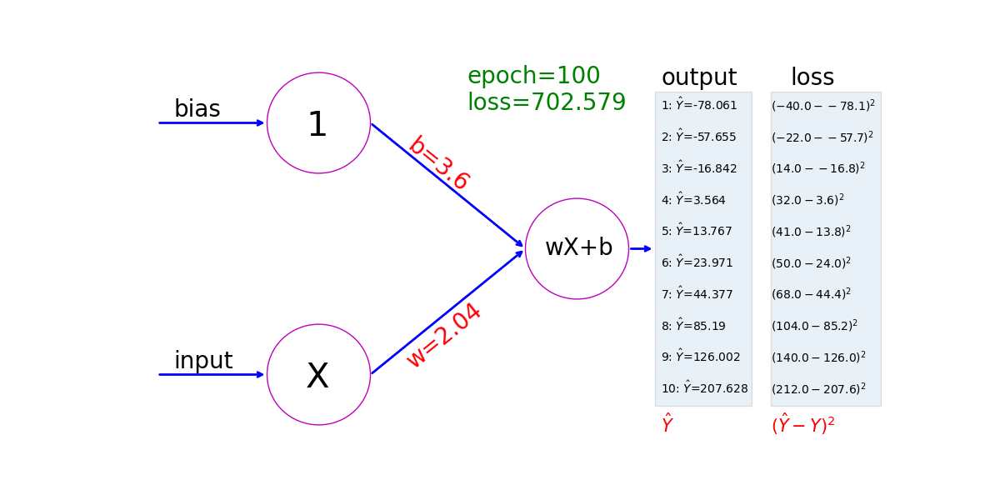
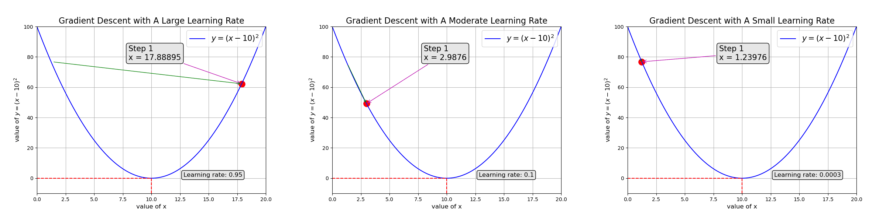

自用笔记。笔记的方向：数学 + 深度学习。把这些基础学牢，看各种论文就比较轻松。尤其是现在有LLM的加持，论文读不清楚，可以让LLM帮忙拆解成基础知识来读。

* 机器学习领域的知识学得快（学会+实操。强调“实操”是因为机器学习知识的实操相对比较简单，不像视唱练耳，比如相对音高的概念非常简单，但是一些人死活也听不出相对音高），但忘得也快。
  而如果有笔记记录，可以快速refresh各种知识 + 学习过程中遇到的坑，避免反复掉坑。
* **尽管ML代码由于涉及很多数学公式，因此可能很复杂，但另一方面，数学公式是很固定的，且ML的工程实践+代码又比较模板化，因此结合LLM，可以极大地帮助写代码。**
  **初学ML的过程中，更推荐重理解，轻代码（比如用代码手写数学公式，很容易卡死。数学大佬随意）。等之后真实践了，让LLM帮忙写代码，自己看得懂，能理解就行。**
  
  另外，在LLM时代，单从开发角度来说，开发任意类型项目的难点在于：1. 公司组织架构（注意：不是项目架构，而是整个公司的组织架构），公司的组织架构决定公司整体的技术架构，进而决定项目的技术架构=>开发栈+功能设计等等；2. 功能模块的tokens总数（如果功能模块只有几K行代码，那可以很轻松地把它输入给LLM，让它增删改功能，基本全靠自动挡；而如果功能模块有几十万行代码）。 
  
* 不要觉得ML难学。对于程序员来说，学ML其实还是舒适区，学习成本极低（P.S. 学iOS开发的成本都比ML高），学习过程中的实验成本也极低，一次不成功能学/试无数次。
  1. 不像做产品，一方面，在当今应用极度饱和的设计出能满足人真实需求的产品，还是相当有难度的，产品既要能满足功能需求，很可能还要满足情感需求（比如实现用户的存在感）。且如果不是做程序员自嗨水平的产品，还要懂得申请各种资质牌照、品牌设计、市场营销、商务谈判、团队管理等等领域知识，最重要的是实践，比如商务谈判，如果跟别人谈崩了，可没啥重试的机会。当然可以找别人做这些事，但找别人做，可是得给别人发工资呢，而给别人发工资的钱可是远远大于学ML要花的钱。
  2. 在现在有LLM加持的时代，“知识”已经垂手可得了，也极大地贬值了。学习过程中遇到各种难题+不解都可以问LLM，以前哪有这种机会。
* ML的真正难点主要是4个：1. 花了大钱+大精力训练模型，结果其他厂家搞了个更牛逼+开源的；2. 花了大钱+大精力基于当下最前沿的模型做训练，结果又一篇开天辟地的论文出现了；2. 没钱；3. 没数据
* ML只是工具，不要过度自嗨。除了同行自嗨，对于最终产品而言，用户不关心用了什么技术，用户只关心这个产品能不能满足ta的需求+用的爽不爽。
* P.S. Python真的是Shit级别的软件工程设计（如果它有的话），是第二好的软件工程设计领域的反面教材（第一好的反面教程是C++）。
  一个软件工程领域的常识就是：复杂度不会消失，只会转移。Python，编译时不报错，所以运行时报错；不写变量类型，所以得靠库作者要写好文档，或者自己一层层看源码来猜；没有接口，所以来靠用户读清文档（如果有的话）来实现接口函数，等等。
  Python的火爆恰恰说明了一个道理：风口来的时候，只要站在风口上，猪都能飞起来。

# 相关资料+书籍

基本原则：

* 高数：基本无所谓出版时间，哪本书讲得清楚就看啥书，反正高数知识不会过时。只是尽量找高数+ML结合的书来看，这样学高数不枯燥，也能顺带学如何把高数用到ML。
* ML基础：学ML基础知识最远可以看近5年出的书，最好近3年，一般没必要看更早的书，很多库的API+主流技术路线+功能特性等很可能都变了，毕竟新的好书可太多了。学成熟的工业实践可以看近2年的书，学前沿+探索性+当下的知识看论文。当然，如果新书够好，就少看旧书。
* 注意：如果读一本书/教程，读着读着，发现某个章节知识的难度太高，实在学不会，那一般是因为： 这教程不是面向自己水平的人群，或者写这教程的人不会教，有些人自己水平高，所以很多事情的内在逻辑是“显而易见，可得...”，导致直接就跳过很多中间推导（如背后的数学公式+ML基础知识）的过程，而自己作为初学者很可能不知道教程跳过了这些知识的存在。因此：
	* 建议交叉学各种教程，这种效率最高，螺旋式学习。
	* 多找循序渐进的教程来看。这里特别强调`循序渐进`，因为很多教程看似循序渐进，但忽略了大量有助于学习+理解的细节知识。类似`[1,2,3,4,5]`是循序渐进，但`[1, 1.01, 1.02, ..., 5]`更加循序渐进。而学前者，很容易遇到不明白的知识，然后以为是自己的问题，但如果遇到好的循序渐进的教程，一个个知识点学过去+实践，学得很踏实+舒心。
	* 多问LLM。

* https://www.mathsisfun.com/calculus/ ：适合高数入门。非常通俗易懂，非常循序渐进，非常简要，非常推荐。
* 《深度学习的数学》：
* 《破解深度学习》：推荐。
* https://d2l.ai/ ：适合懂了之后，做查漏补缺+复习。教程不够循序渐进，面向的其实不是真小白。
  P.S. 在日语学习圈子里，很多人会说自己从来没学过日语，但日语能听懂，又能说，再细问，看了10年的日本综艺+电影+电视剧。AI圈同理，肯定有人会说，我从来没学过，一看就懂，但不要一些这些人真的是“零基础”。
# 数学

工具
* 公式可视化：https://www.wolframalpha.com/input?i2d=true&i=2x&lang=zh
* 数学公式识别（如识`以LaTeX文本形式输出附件中的公式`）+求解：
	* deepseek或其他GPT
	* https://notegpt.io/ai-math-solver
* 数学学习“词典”：https://www.mathsisfun.com/calculus/

学习建议：

1. **高数基础不难，只要多些耐心，一步步、踏实地慢慢学。**
   **高数基础不难，只要多些耐心，一步步、踏实地慢慢学。**
   **高数基础不难，只要多些耐心，一步步、踏实地慢慢学。**
2. **可视化+看图！可视化+看图！可视化+看图！** 很多概念相对抽象，但一看图就豁然开朗了，因此如果学不懂一个概念，那就找它的图来看。
3. **`公式`和`代码`要结合起来看！`公式`和`代码`要结合起来看！`公式`和`代码`要结合起来看！**
   P.S. 这点跟学乐器很像，一些人看到乐器（类比为代码）就能演奏，但一看到乐谱（类比为数学公式）就懵逼了，反之亦然。但二者其实是相辅相成的，代码具体，公式抽象，因此二者一起学，能同时加深对二者的理解。
4. 初学ML时，可以先粗略地学一遍线性代数、微积分、概率统计，混个眼熟，然后通常不用特意宽泛地学数学，而是学ML的时候，再遇到相关数学知识，再专门学其相关的数学知识，这样带着问题去学，这样学习更有趣+更记得牢+能知道怎么把数学知识用到实处。
5. 对于很多概念+公式，主要以理解为主，老是记不住也没事，因为：如果天天用，那很容易就顺便记住了，而如果不用，那现在记得再老，因为基本用不到，也会忘。所以不要强求记住，能理解就好。
6. ML基础学完后，如果有兴趣，可以再找专门讲解ML中的数学的书来看。加深对ML背后数学运用的理解。
7. 另外，学习的过程中，如果搞不明白一些数学细节（尤其是某某代码为什么这么写，其背后的数学原理是啥？），则问问LLM。非常好用。

## 作用

* 高数是深度学习的基础。学好高数基础，再学深度学习，就会轻松非常多，否则学深度学习也会蒙蔽，否则会经常卡死在“为什么代码要这么写？”。
* 前向传播用线性代数：线性代数在处理神经网络中的矩阵和向量运算中起着关键作用。例如，神经网络的输入通常是以矩阵或向量的形式表示数据，而各层之间数据的传递依赖于矩阵乘法和加法等运算。此外，卷积、反卷积、池化、上采样等操作都涉及矩阵的处理。
* 反向传播基于微积分：神经网络的训练基于梯度下降算法，其核心是求解损失函数的最小值。这涉及函数的求导（微分）操作，需要理解函数梯度、梯度下降法则等概念。反向传播算法就是基于链式法则的微分运算。
* 损失函数的构建则大量依赖概率统计：概率统计是理解和表达神经网络内部及其性能中不确定性的基础。在实际应用中，我们可能会遇到带有噪声的训练数据，或需要评估分类任务中各个类别的概率。此外，一些高级深度学习模型，如生成对抗网络(GAN)和变分自编码器(VAE)，均建立在概率论的框架之上。

# 深度学习基础

## 人工神经网络基础（Artificial Neural Network (ANN)）

### 生物学中的神经网络

大脑的神经元​
1. 神经元形成网络。
2. 对于从其他多个神经元传递过来的信号，
	1. 如果它们的和不超过某个固定大小的值（阈值）​，则神经元不做出任何反应。
	   对于生命来说，神经元忽略微小的输入信号，这是十分重要的。反之，如果神经元对于任何微小的信号都变得兴奋，神经系统就将不稳定​。
	2. 如果它们的和超过某个固定大小的值（阈值）​，则神经元做出反应（称为点火）​，向另外的神经元传递固定强度的信号。
3. 从多个神经元传递过来的信号之和中，每个信号对应的权重不一样。

### 人工神经网络（ANN）

是一种监督学习算法，其灵感来自人类大脑的运作方式。类似于神经元在人类大脑中的连接和激活方式，神经网络接受输入并将其传递给一个函数，导致某些后续神经元被激活，从而产生输出。

简单来说，**它可以被看作是一个数学函数，将一个或多个张量（Tensor）作为输入，预测一个或多个张量为输出**。

神经网络的推理过程（而不是训练过程）：


根基：
* **通用逼近定理（Universal approximation theorem）** 表明，我们总能找到一个足够大的神经网络架构，具有合适的权值，可以精确预测任何给定输入的任何输出。这意味着，对于给定的数据集/任务，我们可以创建一个架构，并不断调整其权值，直到 ANN 预测出我们想要的结果。

主要研究领域：
* 计算机视觉涉及图像和视频的识别、分类与处理；
* 语音技术则关注于对人类语音信号的识别和生成；
* 自然语言处理使计算机能够理解和生成人类语言；
* 等等

训练神经网络（training the neural network）：调整权值，直到 ANN 学习给定任务的过程

#### 组成部分（极为重要）

Playground：https://playground.tensorflow.org/


神经网络是由**节点（张量，tensor）** 组成的集合，其中相连的节点之间有一个浮点数称为**权重（Weight）**，并且节点以图的形式互连，以一种由**神经网络架构（Architecture**。用于排列输入与输出连接起来的运算）指定的格式返回输出。

1. **输入层（Input Layers）**：这些层将独立变量作为输入。
2. **隐藏层/中间层（Hidden (intermediate) layers）**：这些层连接输入层和输出层，同时在输入数据上执行转换。此外，隐藏层包含节点​，将输入值修改为高维/低维值（higher-/lower-dimensional values）。通过使用各种激活函数（activation functions）来修改中间层节点的值，实现更复杂的表示功能。
   深度学习中的“深度”（Deep）指的就是更大的隐藏层数。
3. **输出层（Output Layer）**：当输入变量通过网络时，该层生成期望的结果值。

前一层的输出作为下一层的输入，直到输出层。

如果前一层节点和后一层的每个节点之间都有连接，因此被称为“全连接网络“。


输出层中的节点的数量取决于我们是否在预测连续变量还是分类变量。
如果输出是连续变量，则输出有一个节点。
如果输出是具有m个可能类的分类变量，则输出层中有m个节点。

##### 单个神经元处的输入转换（极为重要）

$$
\begin{align*}
a = f\left(w_0 + \sum_{i=1}^n w_i x_i\right)
\end{align*}
$$

该方程表示通过对包括偏差项在内的输入进行**加权和**并将其传递给**激活函数**来计算神经元激活的过程。

- a是输出值
- w0是偏置项（Bias）。
- wi是权重。
- xi是输入特征。
- f是激活函数。


X1，X2，...，Xn是输入变量，W0是偏置项（Bias）。


##### 激活函数（Activation Function）


（注意结合上述的节点输出值的公式来运用激活函数）

作用：现实世界的数据（如图像、语音、文本）通常是非线性的，而激活函数（Activation Function）在神经网络中引入非线性，使模型能够学习这些复杂模式。如果没有激活函数，神经网络将退化为线性模型，无论有多少层，其表达能力都会受到极大限制。

具体来说

* 避免退化线性模型：无激活函数时，多层网络等价于单层，失去深度学习的优势。
* 逼近复杂函数，增强表达能力：非线性激活函数使网络能够拟合任意连续函数（万能逼近定理）。
* 分层特征学习：不同层通过非线性组合逐步抽象高级特征。
	* 浅层学习低级特征（如边缘、纹理）。
	* 深层组合低级特征为高级特征（如物体、语义）。
* 优化梯度：选择合适的激活函数（如 ReLU）能优化梯度流动，缓解梯度消失/爆炸问题，加速训练。

对比表：

| **激活函数**                  | **数学公式**                             | **输出范围**   | 代码实现                                                              | **优点**       | **缺点**            | **适用场景**         |
| ------------------------- | ------------------------------------ | ---------- | ----------------------------------------------------------------- | ------------ | ----------------- | ---------------- |
| **Sigmoid（Logistic 函数）**  |  | (0,1)(0,1) |                                                                   | 平滑，适合概率输出    | 梯度消失，计算成本高        | 二分类输出层           |
| **Tanh（双曲正切函数）**          |  | (−1,1)     | def tanh(x): return (np.exp(x)-np.exp(-x))/(np.exp(x)+np.exp(-x)) | 输出以 0 为中心    | 梯度消失问题            | 隐藏层              |
| **ReLU（修正线性单元）**          | max⁡(0,x)                            | [0,+∞)     |                                                                   | 计算快，缓解梯度消失   | 神经元可能“死亡”（输出恒为 0） | 隐藏层（最常用）         |
| **Leaky ReLU（带泄漏的 ReLU）** |  | (−∞,+∞)    |                                                                   | 缓解 ReLU 死亡问题 | 需调参 αα            | 隐藏层（改进 ReLU）     |
| **Softmax（多分类归一化函数）**     |  | (0,1)      | def softmax(x): return np.exp(x)/np.sum(np.exp(x))                | 多分类概率归一化     | 仅用于输出层            | 多分类输出层           |
| **Swish（自门控激活函数）**        |  | (−∞,+∞)    |                                                                   | 平滑，优于 ReLU   | 计算稍复杂             | 隐藏层（Google 提出）   |
| **GELU（高斯误差线性单元）**        |  | (−∞,+∞)    |                                                                   | 类似 ReLU，但更平滑 | 计算复杂              | Transformer/BERT |

如何选择激活函数：
- **隐藏层**：优先使用 **ReLU**（计算快），可尝试 **Leaky ReLU** 或 **Swish**。
- **二分类输出层**：**Sigmoid**。
- **多分类输出层**：**Softmax**。
- **需要平滑梯度时**：**Tanh** 或 **GELU**（如自然语言处理模型）。

##### 成本函数（Cost functions）

作用：
* 用于计算损失值（Loss Values），即预测值与实际值之间的误差值。该误差值会在之后的反向传播过程中，用于找到损失为零或接近零的最佳权重。

###### 计算方式

连续变量（Continuous variable）预测中的损失计算：

使用均方误差（Mean squared error）损失函数计算：
  $$\begin{align*}
f_\theta &= \frac{1}{m}\sum_{i=1}^m (\mathbf{y}_i - \hat{\mathbf{y}}_i)^2 \\
\hat{\mathbf{y}}_i &= \eta_\theta(\mathbf{x}_i)
\end{align*}$$


m是数据量

```python
def mse(p, y):
    return np.mean(np.square(p - y))
```

使用平均绝对误差（Mean Absolute Error）

```python
def mae(p, y):
    return np.mean(np.abs(p-y))
```

---

分类变量（Categorical variable）预测中的损失计算：

当要预测的变量是离散的（即变量中只有几个类别）​，我们通常使用分类交叉熵损失函数（cross-entropy loss function）。

	  $$
- \frac{1}{m} \sum_{j=1}^C \sum_{i=1}^m y_i \log(p_i)
$$


当正确类的概率高时，损失值较小。概率范围在0到1之间。因此，当概率为1时，最小可能损失为0，当概率为0时，最大损失为无穷大。

```python
def categorical_cross_entropy(p, y):
    return -np.mean(np.log(p[np.arange(len(y)),y]))
```

当要预测的变量有两个不同的值时，损失函数是二进制交叉熵（binary cross-entropy loss function）。

$$
\frac{1}{m} \sum_{i=1}^m \left( y_i \log(p_i) + (1 - y_i) \log(1 - p_i) \right)
$$


```python
def binary_cross_entropy(p, y):
    return -np.mean((y*np.log(p)+(1-y)*np.log(1-p)))
```
	
#### 前馈传播（Feedforward Propagation）与反向传播（Backpropagation）（极为重要）

**前馈传播：数据通过网络逐层前向传播，计算每一层的输出，直到得到最终的预测值和损失函数（Loss）**
**反向传播：从输出层开始，基于误差调整权重，逐层反向计算梯度，利用链式法则将梯度分解为局部梯度的乘积**
**反复迭代（反复进行前馈传播+反向传播）直至模型收敛。每论迭代被称作周期（epoch）**

| **对比项**    | **前馈传播**   | **反向传播**    |
| ---------- | ---------- | ----------- |
| **方向**     | 输入层 → 输出层  | 输出层 → 输入层   |
| **作用/目的**  | 计算预测值      | 计算梯度并更新权重   |
| **计算内容**   | 加权和 + 激活函数 | 误差传播 + 链式求导 |
| **是否需要标签** | 不需要（仅前向计算） | 需要（依赖损失函数）  |






##### 坡度（Slope或Gradient）

**深度学习中的`坡度`指的是：损失变化率，即相对于预测的输出值或权重值，损失的坡度**

**深度学习中的`坡度`指的是：损失变化率，即相对于预测的输出值或权重值，损失的坡度**

**深度学习中的`坡度`指的是：损失变化率，即相对于预测的输出值或权重值，损失的坡度**


**为什么是相对于预测的输出值或权重值？因为这样就能反推出需要增大或缩小预测的输出值以减少损失值，进而反推出要增大或缩小权重。**

**坡度的两个重要属性：**
- **方向：告诉预测值应该调大还是调小（比如梯度是+1 → 要调大输出）。**
	- **梯度是正 → 往“增加预测值”方向走。**
	- **梯度是负 → 往“减少预测值”方向走。**
- **大小：告诉调整的力度（比如梯度是2比1的调整力度更大）。**

实际计算（以MSE损失为例）


##### 通俗讲解版


比喻：快递配送站
想象你开了一家快递公司，货物从总部（输入层）出发，经过多个配送站（隐藏层），最后送到客户（输出层）。但有一天客户投诉说货物损坏了（损失函数值高），你得找出哪个配送站搞砸了，并惩罚它（调整参数）。

关键问题：
怎么知道是哪个配送站（哪一层）的责任？
答案：反向调查，从客户开始，一层层往回问！

---

**链式法则：责任传递规则**

链式法则就是**责任划分的数学规则**：

如果A的责任影响了B，B的责任又影响了C，那么A对C的责任 = （A对B的责任 × B对C的责任）。

例子：

儿子考试不及格（损失）是因为作业没写好（最后一层），

作业没写好是因为爸爸没辅导（前一层），

爸爸没辅导是因为加班（更前一层）。
那么公司对儿子不及格的责任 = 公司让爸爸加班的责任 × 爸爸没辅导的责任 × 儿子作业差的责任。

---

反向传播的步骤
场景：一个简单神经网络（输入 → 隐藏层 → 输出 → 损失）
前向传播（送货）：

输入数据（比如“猫的图片”）→ 隐藏层计算 → 输出层预测（比如“70%是猫”）→ 计算损失（比如“真实标签是猫，损失=0.3”）。

反向传播（追责）：

第1步：问输出层——“损失0.3是不是你的错？”

输出层说：“部分是我的错，但我也是被隐藏层坑了！我的责任是 ∂Loss/∂输出 = 0.3”（损失对输出的梯度）。

第2步：问隐藏层——“输出层说是你坑了它，你怎么解释？”

隐藏层说：“我的责任 = （输出层的责任 × 我的激活函数的导数）”（链式法则：梯度相乘）。

第3步：更新参数——“根据责任大小，调整你们的工作（权重）！”

如果某层责任大（梯度大），就多调整它的权重；责任小就少调整。

---

通俗版计算公式
输出层责任：
损失对输出的梯度 = (预测值 - 真实值)
（比如预测0.7，真实1.0，责任= -0.3）

隐藏层责任：
损失对隐藏层的梯度 = 输出层的责任 × 隐藏层激活的导数
（比如输出层责任=-0.3，Sigmoid导数=0.25，那么隐藏层责任= -0.3×0.25 = -0.075）

更新权重：
新权重 = 旧权重 - 学习率 × 责任 × 输入值
（比如隐藏层责任=-0.075，输入值是0.5，学习率0.1，则调整量= -0.1 × -0.075 × 0.5 = +0.00375）

5. 关键点总结
链式法则：像追责一样，从后往前乘梯度。

反向传播：从损失开始，逐层计算“谁该背锅”。

参数更新：根据责任大小（梯度）调整权重。

##### 数学基础

* 导数：用于计算相对于预测的输出值，损失的坡度（Slope或Gradient）。因此，如果坡度越大，说明损失变化率越大。
  换言之，**坡度下降（Gradient Descent）指的就是在执行反向传播逻辑的过程中，让损失率（坡度）下降的过程，而随机坡度下降（Stochastic gradient descent）中的“随机”指的是使用随机的样本**。
  https://www.mathsisfun.com/calculus/derivatives-introduction.html
  
* 导数的链式法则的运用：
  * 通用步骤：
    * 计算当前层的输出对输入的梯度（局部梯度）。
    * 接收来自上一层的梯度（上游梯度）。
    * 将两者相乘，得到当前层的输入梯度。
    * 继续反向传递梯度，并计算参数梯度。
  对应上述例子中的：公司对儿子不及格的责任 = 公司让爸爸加班的责任 × 爸爸没辅导的责任 × 儿子作业差的责任
  
* 偏导数：


代码实现——基于数值法（有限差分）计算梯度，更新权重

```python
import numpy as np  
from copy import deepcopy  
import matplotlib.pyplot as plt  
  
  
def feed_forward(inputs, outputs, weights):  
    # inputs * 权重 + 偏移值  
    pre_hidden = np.dot(inputs, weights[0]) + weights[1]  
    # 应用sigmoid激活函数，计算隐藏层节点值  
    hidden = 1 / (1 + np.exp(-pre_hidden))  
    out = np.dot(hidden, weights[2]) + weights[3]  
    mean_squared_error = np.mean(np.square(out - outputs))  
    return mean_squared_error  
  
  
def update_weights(inputs, outputs, weights, lr):  
    """  
    过程：前馈传播 + 反向传播  
    """    original_weights = deepcopy(weights)  
    updated_weights = deepcopy(weights)  
    # 通过前馈传播，计算出初始loss，用于后面根据该loss做优化  
    original_loss = feed_forward(inputs, outputs, original_weights)  
  
    for i, layer in enumerate(original_weights):  
        for j, weight in np.ndenumerate(layer):  
            temp_weights = deepcopy(weights)  
            # 微调权重值，计算相对于权重0.0001，loss的梯度  
            temp_weights[i][j] += 0.0001  
            _loss_plus = feed_forward(inputs, outputs, temp_weights)  
            # 梯度（grad） 是loss的导数，指向函数值（这里是误差 loss）增长最快的方向。  
            # 我们的目标是最小化误差，因此需要沿着梯度的反方向调整权重。  
            grad = (_loss_plus - original_loss) / 0.0001  
            # 梯度下降的具体实现，通过沿负梯度方向微调权重，逐步逼近最优解。  
            # 梯度的方向性：  
            # * 如果 grad > 0，说明增加权重会增大误差，因此需要减小权重（-= grad * lr）。  
            # * 如果 grad < 0，说明增加权重会减小误差，因此需要增大权重（-= 负梯度相当于 += 正数）。
            updated_weights[i][j] -= grad * lr  
    return updated_weights, original_loss  
  
  
if __name__ == '__main__':  
    initial_inputs = np.array([[1, 1]])  
    expected_outputs = np.array([[0]])  
    # 随机初始化权重与偏移值  
    weights_and_biases = [  
        # 输入层到隐藏层的权重  
        np.array([[-0.0053, 0.3793],  
                  [-0.5820, -0.5204],  
                  [-0.2723, 0.1896]], dtype=np.float32).T,  
        # 输入层到隐藏层的偏移值  
        np.array([-0.0140, 0.5607, -0.0628], dtype=np.float32),  
        # 隐藏层到输出层的权重  
        np.array([[ 0.1528, -0.1745, -0.1135]], dtype=np.float32).T,  
        # 隐藏层到输出层的偏移值  
        np.array([-0.5516], dtype=np.float32)  
    ]  
    losses = []
    # 训练1000个周期
    for epoch in range(1000):  
        weights_and_biases, loss = update_weights(initial_inputs, expected_outputs, weights_and_biases, 0.01)  
        losses.append(loss)  
    plt.plot(losses)  
    plt.title('Loss over increasing number of epochs')
    plt.show()
```

优化版——通过解析法（数学公式=导数的链式法则）直接计算梯度，更新权重

```python
from copy import deepcopy  
import numpy as np  
  
  
def line():  
    print('=' * 80)  
  
  
def feed_forward(inputs, outputs, weights):  
    pre_hidden = np.dot(inputs, weights[0]) + weights[1]  
    hidden = 1 / (1 + np.exp(-pre_hidden))  
    out = np.dot(hidden, weights[2]) + weights[3]  
    mean_squared_error = np.mean(np.square(out - outputs))  
    return mean_squared_error  
  
  
def update_weights(inputs, outputs, weights, lr):  
    original_weights = deepcopy(weights)  
    temp_weights = deepcopy(weights)  
    updated_weights = deepcopy(weights)  
    original_loss = feed_forward(inputs, outputs, original_weights)  
    for i, layer in enumerate(original_weights):  
        for index, weight in np.ndenumerate(layer):  
            temp_weights = deepcopy(weights)  
            temp_weights[i][index] += 0.0001  
            _loss_plus = feed_forward(inputs, outputs, temp_weights)  
            grad = (_loss_plus - original_loss) / 0.0001  
            updated_weights[i][index] -= grad * lr  
    return updated_weights  
  
  
if __name__ == '__main__':  
    x = np.array([[1, 1]])  
    y = np.array([[0]])  
    W = [  
        np.array([[-0.0053, 0.3793],  
                  [-0.5820, -0.5204],  
                  [-0.2723, 0.1896]], dtype=np.float32).T,  
        np.array([-0.0140, 0.5607, -0.0628], dtype=np.float32),  
        np.array([[0.1528, -0.1745, -0.1135]], dtype=np.float32).T,  
        np.array([-0.5516], dtype=np.float32)  
    ]  
    line()  
    print('Loss:'.upper())  
    print(feed_forward(x, y, W))  
    line()  
    print('Weights:'.upper())  
    [print(w) for w in W]  
    line()  
    print('Updated Weights:'.upper())  
    for epx in range(1):  
        updated_weights = update_weights(x, y, W, 1)  
    [print(w) for w in updated_weights]  
  
    # tmp是通过链式法则手动推导的权重更新公式计算的值，  
    # 它的值与对应的 update_weights 值相似，可互相验证，测试函数是否正确实现了梯度下降  
    pre_hidden = np.dot(x, W[0]) + W[1]  
    hidden = 1 / (1 + np.exp(-pre_hidden))  
    predicted_value = np.dot(hidden, W[2]) + W[3]    
    
    # tmp = 原始权重 - (解析梯度 * 学习率)  
    # updated_weights = 原始权重 - (数值梯度 * 学习率)
  
    # 以第一个 tmp 为例：  
  
    # (0 - (predicted_value[0][0]))：  
    # 损失函数是均方误差（MSE），其梯度为 预测值 - 真实值（这里真实值 y=0）。  
    # 对应反向传播中输出层的梯度 ∂L/∂out = (predicted_value - y)。  
  
    # W[2][0][0] * hidden[0,0] * (1 - hidden[0,0]) * x[0][0]：  
    # 这是链式法则的逐层反向传播：  
    # W[2][0][0]：输出层权重 → 隐藏层输出的梯度。  
    # hidden[0,0] * (1 - hidden[0,0])：Sigmoid激活函数的导数。  
    # x[0][0]：输入值 → 权重梯度的局部贡献。  
  
    # -2 * ...：  
    # MSE损失的导数包含系数 2（即 dL/dout = 2*(out - y)），但代码中可能省略了 1/2，因此显式写出 -2。  
  
    # W[0][0][0] - (grad * lr)：  
    # 标准的梯度下降更新公式（学习率 lr=1）。  
    tmp = W[0][0][0] - (-2 * (0 - (predicted_value[0][0])) * (W[2][0][0]) * hidden[0, 0] * (1 - hidden[0, 0]) * x[0][0])  
    print(tmp, updated_weights[0][0][0])  
    tmp = W[0][0][1] - (-2 * (0 - (predicted_value[0][0])) * (W[2][1][0]) * hidden[0, 1] * (1 - hidden[0, 1]) * x[0][0])  
    print(tmp, updated_weights[0][0][1])  
    tmp = W[0][0][2] - (-2 * (0 - (predicted_value[0][0])) * (W[2][2][0]) * hidden[0, 2] * (1 - hidden[0, 2]) * x[0][0])  
    print(tmp, updated_weights[0][0][0])  
    tmp = W[0][1][0] - (-2 * (0 - (predicted_value[0][0])) * (W[2][0][0]) * hidden[0, 0] * (1 - hidden[0, 0]) * x[0][1])  
    print(tmp, updated_weights[0][1][0])  
    tmp = W[0][1][1] - (-2 * (0 - (predicted_value[0][0])) * (W[2][1][0]) * hidden[0, 1] * (1 - hidden[0, 1]) * x[0][1])  
    print(tmp, updated_weights[0][1][1])  
    tmp = W[0][1][2] - (-2 * (0 - (predicted_value[0][0])) * (W[2][2][0]) * hidden[0, 2] * (1 - hidden[0, 2]) * x[0][1])  
    print(tmp, updated_weights[0][1][2])  
    
    tmp = W[1][0] - (-2 * (0 - (predicted_value[0][0])) * hidden[0, 0] * (1 - hidden[0, 0]) * W[2][0][0])  
    print(tmp, updated_weights[1][0])  
    tmp = W[1][1] - (-2 * (0 - (predicted_value[0][0])) * hidden[0, 1] * (1 - hidden[0, 1]) * W[2][1][0])  
    print(tmp, updated_weights[1][1])  
    tmp = W[1][2] - (-2 * (0 - (predicted_value[0][0])) * hidden[0, 2] * (1 - hidden[0, 2]) * W[2][2][0])  
    print(tmp, updated_weights[1][2])  
    
    tmp = W[2][0][0] - (-2 * (0 - (predicted_value[0][0])) * hidden[0][0])  
    print(tmp, updated_weights[2][0][0])  
    tmp = W[2][1][0] - (-2 * (0 - (predicted_value[0][0])) * hidden[0][1])  
    print(tmp, updated_weights[2][1][0])  
    tmp = W[2][2][0] - (-2 * (0 - (predicted_value[0][0])) * hidden[0][2])  
    print(tmp, updated_weights[2][2][0])  
    
    tmp = W[3][0] - (-2 * (0 - (predicted_value[0][0])))  
    print(tmp, updated_weights[3][0])

```
###### 学习率（Learning Rate）

控制更新的步长，避免因梯度太大而“跨过”最优值。  
如果学习率太大：可能震荡或发散。
如果学习率太小：收敛过慢。  



#### 超参数（Hyperparameters）

一些算法工程师被戏称为调参侠，由此可见超参数在实践中的重要性。

| **超参数类型**              | **代表参数**                  | **作用**                    | **典型取值/范围**                               | **调整策略**                                                              |
| ---------------------- | ------------------------- | ------------------------- | ----------------------------------------- | --------------------------------------------------------------------- |
| **学习率（Learning Rate）** | `lr`                      | 控制参数更新的步长，决定损失函数的收敛速度和稳定性 | 0.001 (Adam), 0.1 (SGD)                   | - 学习率衰减（如 `lr=0.1→0.01→0.001`）  <br>- 使用学习率调度器（如 `ReduceLROnPlateau`） |
| **批量大小（Batch Size）**   | `batch_size`              | 影响梯度计算的稳定性和内存占用           | 32, 64, 128, 256                          | - 大 batch 需增大学习率  <br>- 小 batch 适合小数据集（防过拟合）                          |
| **优化器（Optimizer）**     | `optim.SGD`, `optim.Adam` | 决定参数更新的算法（如动量、自适应学习率等）    | Adam (默认 `lr=0.001`), SGD (动量=0.9)        | - Adam 适合大多数场景  <br>- SGD + 动量需调参更谨慎                                  |
| **网络结构**               | 层数、神经元数                   | 影响模型的容量和表达能力              | - CNN: 3~20 层  <br>- Transformer: 12~24 层 | - 从小网络开始逐步增加复杂度  <br>- 使用残差连接（ResNet）防梯度消失                            |
| **正则化参数**              | `weight_decay` (L2)       | 控制权重衰减强度，防止过拟合            | 0.0001~0.01                               | - 结合 Dropout 使用  <br>- 高 `weight_decay` 可能欠拟合                         |
| **Dropout 率**          | `dropout_rate`            | 随机丢弃神经元比例，防止过拟合           | 0.2~0.5                                   | - 输入层 Dropout 率较低（如 0.1）  <br>- 宽层可用更高 Dropout                        |
| **激活函数**               | `ReLU`, `GELU`            | 引入非线性，决定神经元的输出方式          | ReLU (CNN), GELU (Transformer)            | - 死 ReLU 问题可换 `LeakyReLU`  <br>- 输出层用 `Sigmoid`（二分类）或 `Softmax`（多分类）  |
| **损失函数**               | `CrossEntropyLoss`, `MSE` | 衡量模型预测与真实值的差异             | 分类: CE, 回归: MSE                           | - 类别不平衡时用 `Focal Loss`  <br>- 多任务学习需自定义损失组合                           |
| **训练轮数（Epochs）**       | `epochs`                  | 控制训练迭代次数                  | 10~1000 (依数据量而定)                          | - 早停法（Early Stopping）防过拟合  <br>- 监控验证集损失                              |
| **初始化方法**              | `Xavier`, `He`            | 影响初始参数分布，决定训练稳定性          | `He` (ReLU), `Xavier` (Tanh)              | - 预训练模型初始化（如 BERT、ResNet）                                             |

##### **超参数调整注意事项**

1. **学习率 vs Batch Size**
    
    - 大 `batch_size` 需增大 `lr`（线性缩放规则：`lr_new = lr_base × (batch_new / batch_base)`）。
        
    - 例：`batch=256` 时 `lr=0.1` → `batch=512` 时 `lr=0.2`。
        
2. **优化器选择**
    
    |优化器|适用场景|调参重点|
    |---|---|---|
    |**SGD**|需要精细调参（如图像分类）|`lr`, `momentum=0.9`|
    |**Adam**|默认选择（尤其是 NLP/RL）|`lr=0.001`（通常不动）|
    |**AdamW**|结合 L2 正则化（如 Transformer）|`weight_decay=0.01`|
    
3. **网络深度与宽度**
    
    - **深度**：增加层数可提升特征抽象能力，但需配合残差连接。
        
    - **宽度**：增加神经元数需注意参数爆炸（参数量 ≈ 输入维度 × 输出维度）。
        
4. **正则化组合**
    
    - `Dropout + L2` 通常比单独使用效果更好。
        
    - 示例配置：
        
        python
        
        复制
        
        model = nn.Sequential(
            nn.Linear(100, 200),
            nn.Dropout(0.5),  # 隐藏层 Dropout
            nn.ReLU(),
            nn.Linear(200, 10)
        )
        optimizer = Adam(model.parameters(), lr=0.001, weight_decay=0.0001)
        

---

##### **自动化调参工具**

|工具|方法|适用场景|
|---|---|---|
|**Grid Search**|暴力搜索所有组合|超参数较少（<5）|
|**Random Search**|随机采样超参数空间|高效，推荐默认使用|
|**Bayesian Optimization**|基于概率模型优化|计算资源有限时|
|**Optuna**|支持多种采样算法（如 TPE）|复杂超参数空间|

---

##### **总结**

- **核心超参数**：学习率、批量大小、优化器、正则化。
    
- **调整原则**：从小规模开始，逐步增加复杂度，监控训练/验证损失。
    
- **经验法则**：
    
    - CNN：优先调 `lr` 和 `batch_size`。
        
    - Transformer：关注 `lr`、`weight_decay` 和 `warmup_steps`。

#### 超参数——批次大小（Batch Size）

##### 作用

**影响训练时间和模型的泛化能力。**
* **较小的批次大小允许模型从每个Sample中学习，但训练时间会更长。**
* **较大的批次大小训练速度更快，但可能会导致模型无法捕捉数据中的细微差别。**

换言之，**在内存不溢出的情况下（因此batch size不能太大），提升GPU的利用率（而不是在等加载数据的IO），减少训练所需时间。**

更具体地来说，

1. 计算效率优化
硬件利用率：现代GPU/TPU等加速器擅长并行计算，合适的batch size能最大化利用计算单元

减少I/O开销：批量加载数据比单样本反复加载更高效（减少数据从内存到显存的传输次数）

向量化计算：矩阵运算比循环处理单样本快几个数量级

2. 梯度质量控制
噪声调节：小batch引入梯度噪声有助于逃离局部最优；大batch提供更准确的梯度方向

优化稳定性：中等batch size平衡了梯度估计的偏差和方差

3. 内存管理
显存占用调控：batch size直接决定每次计算的内存需求

大模型支持：通过调整batch size使大模型能在有限内存中训练

4. 训练动态影响
正则化效应：小batch size天然具有类似dropout的正则化效果

收敛行为：影响参数更新频率和方向（大batch更新次数少但方向准）

##### 如果不使用Batch Size的两种情况

###### 情况1：Batch Size=1（纯SGD）

会发生什么：

1. **计算极端低效**
    
    - 无法利用硬件并行能力
        
    - 90%以上时间可能花费在数据I/O而非实际计算
        
    - 典型速度比合理batch size慢50-100倍
        
2. **训练极度不稳定**
    
    - 每个样本都带来剧烈的参数波动
        
    - 需要极小的学习率导致收敛缓慢
        
    - 示例：在ResNet训练中可能完全无法收敛
        
3. **实现问题**
    
    - Batch Normalization完全失效（无法计算有意义的统计量）
        
    - 某些框架对小batch优化不足（如CUDA内核启动开销显著）
        
4. **理论优势（在特定场景）**
    
    - 对在线学习/非平稳目标可能更灵活
        
    - 在凸优化中有更好的理论收敛保证
        

###### 情况2：Batch Size=全体训练数据（纯Batch GD）

会发生什么：

1. **计算可行性问题**
    
    - 现代数据集（如ImageNet）根本无法放入任何GPU内存
        
    - 即使放入，前向传播的中间激活值也会耗尽内存
        
2. **优化困境**
    
    - 完全失去梯度噪声带来的正则化效果
        
    - 几乎必定收敛到尖锐最小值，测试误差显著升高
        
    - 实验显示在CIFAR10上测试误差可能比合理batch size高2-5%
        
3. **计算资源浪费**
    
    - 每个epoch只更新一次参数，大部分时间在计算"完美"梯度
        
    - 对非凸问题可能陷入糟糕的局部最优无法逃脱
        
4. **理论优势**
    
    - 在凸二次优化中有最优收敛率
        
    - 梯度方向完全准确（无方差）

##### Batch Size的折中价值（Mini-batch GD）

合理batch size（如32-256）实现了：

1. **计算与统计效率的平衡**
    
    - 足够大以利用硬件并行性
        
    - 足够小以保持有益的梯度噪声
        
2. **内存与性能的平衡**
    
    - 适应GPU内存限制
        
    - 保持较高的参数更新频率
        
3. **优化与泛化的平衡**
    
    - 梯度方向足够可靠
        
    - 保留逃离局部最优的能力
        

##### 实际影响示例

| 场景             | 合理batch size | Batch Size=1 | Batch Size=全体数据 |
| -------------- | ------------ | ------------ | --------------- |
| 训练时间（相同epoch）  | 1小时          | 3天           | 内存溢出            |
| 测试准确率（CIFAR10） | 93.5%        | 不收敛          | 89.2%           |
| GPU利用率         | 98%          | 15%          | OOM错误           |
| 收敛所需epoch数     | 100          | 3000+        | 50（但效果差）        |
|                |              |              |                 |
|                |              |              |                 |
|                |              |              |                 |

##### 最佳实践

1. **选择策略**
    
    - 从GPU能承受的最大batch size开始
        
    - 逐步减小直到验证集性能不再提升
        
    - 常用范围：计算机视觉（64-512），NLP（16-128）
        
2. **辅助技术**
    
    - 大batch训练时：使用学习率预热、线性缩放规则
        
    - 小batch训练时：梯度累积模拟大batch
        
3. **特殊场景处理**
    
    - 超大模型：使用微batch size（甚至=1）配合梯度检查点
        
    - 强化学习：常用小batch实现高探索性
        

# PyTorch

## 自动微分（autograd）——极为重要，一定要理解代码

```python
import torch  
  
if __name__ == '__main__':  
    # 设置requires_grad=True，表示我们需要计算关于这个张量的梯度。
    x = torch.tensor([[2., -1.], [1., 1.]], requires_grad=True)  
    print(x)  
  
    out = x.pow(2).sum()  
  
    print(out)  
    
    # 执行反向传播，计算out相对于所有requires_grad=True的张量（这里只有x）的梯度。
    out.backward()  
    
    # - `x.grad`是一个与x同形状的张量，它包含了out相对于x的偏导数（∂out/∂x），即每个值来自公式：∂out/∂x[i][j]=2x[i][j]。
    # - 因为out是x中每个元素的平方和，所以对于x的每个元素xᵢ，∂out/∂xᵢ = 2*xᵢ
    # - 因此对于初始值 `x = [[2, -1], [1, 1]]`，梯度应该是 `[[4, -2], [2, 2]]`
    
    # `x.grad`的语义是：表示了输出值out相对于输入张量x中每个元素的敏感度（变化率），也就是告诉我们如果稍微改变x中的某个元素，out值会如何变化。
    # `x.grad[i][j]` 的值越大，说明 `x[i][j]` 对 `out` 的影响越大（越敏感）。
    # `x.grad[i][j]` 是正数，则说明增加 `x[i][j]` 会使 `out` 变大。
    print(x.grad)
```

## 梯度下降——极为重要，一定要理解代码

-在优化问题（如神经网络训练）中，我们通常希望让上述的 `out` 最小化（损失），因此会沿着梯度的反方向调整 `x`（即 **梯度下降**）。

```python
import torch  
  
if __name__ == '__main__':  
    x = torch.tensor([[2., -1.], [1., 1.]], requires_grad=True)  
    # - 如果`learning_rate`太大（如`lr=1.0`），可能导致`out`震荡甚至发散。  
    # - 如果`learning_rate`太小（如`lr=0.001`），收敛速度会非常慢。  
    learning_rate = 0.1  # 学习率（步长）  
  
    for i in range(100):  
        # 前向计算  
        out = x.pow(2).sum()  
        # 反向传播计算梯度  
        out.backward()  
        # 梯度下降：手动更新 x（关闭自动微分跟踪）  
        with torch.no_grad():  # 禁止自动微分，因为更新操作不需要梯度  
            # 沿着梯度反方向调整 `x`，以使得`out`逐渐接近于0。  
            # 注意：正如上文所述，
            # `x.grad[i][j]` 的值越大，说明 `x[i][j]` 对 `out` 的影响越大（越敏感）。
            # `x.grad[i][j]` 是正数，则说明增加 `x[i][j]` 会使 `out` 变大。
            # 因此，如果`x.grad[i][j]`是正的，说明它让损失值out增大了，所以我们需要降低`x.grad[i][j]`的值；反之，如果`x.grad[i][j]`是负的，说明它让损失值out变小了，所以我们需要增大`x.grad[i][j]`的值
            x -= learning_rate * x.grad  
        # 清空梯度（否则下次 backward() 时梯度会累加）  
        x.grad.zero_()  
        if i % 10 == 0:  
            print(f"Step {i}: out = {out.item()}")  
  
    # 验证更新后的 out 是否变小  
    out = x.pow(2).sum()  
    print(f"更新后 out = {out.item()}")  # 输出: 2.9046630740497977e-19（比 7.0 小）  
    print(f"更新后 x = \n{x}")  # 输出: [[ 4.0741e-10, -2.0370e-10], [ 2.0370e-10,  2.0370e-10]]
```

## 简单+完整+典型的全连接神经网络

```python
import matplotlib.pyplot as plt  
import torch  
import torch.nn as nn  
  
  
class MyNeuralNet(nn.Module):  
    def __init__(self):  
        super().__init__()  
        # 输入层 → 隐藏层 (2 → 8)
        # 对应输入数据的 2 个特征
        self.input_to_hidden_layer = nn.Linear(2, 8)  
        # 隐藏层激活函数 (ReLU)
        self.hidden_layer_activation = nn.ReLU()  
        # 隐藏层 → 输出层 (8 → 1)
        self.hidden_to_output_layer = nn.Linear(8, 1)  
  
    def forward(self, x):  
        # 线性变换: (batch, 2) → (batch, 8)
        x = self.input_to_hidden_layer(x)  
        # ReLU 激活函数
        x = self.hidden_layer_activation(x)  
        # 线性变换: (batch, 8) → (batch, 1)
        x = self.hidden_to_output_layer(x)  
        return x  
  
  
if __name__ == '__main__':  
    x = torch.tensor([  
        [1, 2],  
        [3, 4],  
        [5, 6],  
        [7, 8]  
    ]).float()  
    y = torch.tensor([  
        [3],  
        [7],  
        [11],  
        [15]  
    ]).float()  

    # 初始化神经网络
    mynet = MyNeuralNet()  
    # 使用均方误差 (MSE) 作为损失函数
    loss_fn = nn.MSELoss()  

    # 前向传播计算预测值
    pred = mynet(x)  
    # 计算损失 (MSE)
    loss = loss_fn(pred, y)  
  
    print(loss)  

    # 随机梯度下降优化器
    optimizer = torch.optim.SGD(mynet.parameters(), lr=0.001)  
    loss_history = []  
  
    for _ in range(50):  
        # 清空梯度（防止累积）
        optimizer.zero_grad()  
        # 前向传播
        pred = mynet(x)  
        # 计算损失
        loss = loss_fn(pred, y)  
        # 反向传播计算梯度
        loss.backward()  
        # 更新参数（梯度下降）
        optimizer.step()  
        loss_history.append(loss.item())  
  
    plt.plot(loss_history)  
    plt.title('Loss variation over increasing epochs')  
    plt.xlabel('epochs')  
    plt.ylabel('loss')  
    plt.show()
```

## 分布式训练


# 软件工程

# 读源码

在有以上各种基础知识后，可以读优秀的源码。
如果读不懂，一定记得把代码copy给LLM，问一问，因为一些代码的背后是各种数学公式，自己不一定能看得出，但一问LLM，就豁然开朗了（毕竟LLM连逆向工程都能做，让它看代码，对它是小case）。

# 计算机视觉（CV、Computer Vision）

## 图像预处理

作用：提高模型的训练效率和泛化能力

总结：
* 必须做：尺寸调整、张量转换、归一化。
* 训练时做：数据增强（提升泛化能力）。
* 注意一致性：测试集和训练集的预处理方式需一致（如均值和标准差相同）。

### 常见操作

#### 调整图像尺寸（Resizing）

**为什么做？**  
CNN通常需要固定尺寸的输入（例如224×224），但原始图片大小不一，必须统一缩放。

**怎么做？**

- 直接缩放到目标尺寸（如`resize(224,224)`）。
    
- **注意**：可能引入拉伸变形，可用`保持长宽比的裁剪（Center Crop）`或`填充黑边（Padding）`缓解。
    

**示例代码（Python）**：

```python
from PIL import Image
img = Image.open("cat.jpg").resize((224, 224))  # 直接缩放
```

---

#### 归一化（Normalization）

**为什么做？**  
将像素值从`0~255`缩放到`-1~1`或`0~1`，避免数值过大导致模型训练不稳定。

**怎么做？**

- **方法1**：除以255 → `像素值/255.0`（范围[0, 1]）。
    
- **方法2**：减去均值再除以标准差（常见于预训练模型，如ImageNet的均值`[0.485, 0.456, 0.406]`，标准差`[0.229, 0.224, 0.225]`）。
    

**示例代码**：

```python
import torchvision.transforms as transforms
normalize = transforms.Normalize(mean=[0.485, 0.456, 0.406], std=[0.229, 0.224, 0.225])
```


#### 图像增强（Data Augmentation）（仅训练阶段）

**为什么做？**  
通过轻微扰动原始图像（如旋转、翻转），人工增加数据多样性，防止过拟合。

**常见方法**：

- **随机水平翻转**：`RandomHorizontalFlip()`
    
- **随机旋转**：`RandomRotation(30)`
    
- **颜色抖动**：调整亮度、对比度（`ColorJitter`）
    
- **随机裁剪**：`RandomResizedCrop(224)`
    

**示例代码**：

```python
train_transform = transforms.Compose([
    transforms.RandomHorizontalFlip(),
    transforms.RandomRotation(15),
    transforms.ToTensor(),
    normalize
])
```

#### 转换为张量（To Tensor）

**为什么做？**  
CNN的输入需要是数值张量（Tensor），而非图片文件（如JPEG）。

**怎么做？**

- 将`H×W×C`的图片（Height×Width×Channel）转为PyTorch的`C×H×W`格式张量（或TensorFlow的`H×W×C`）。
    
- 自动将像素值从`0~255`转为`0~1`的浮点数。
    

**示例代码**：

```python
transform = transforms.ToTensor()
tensor_img = transform(img)  # 输出形状：[3, 224, 224]（PyTorch）
```

#### 其他可选预处理

- **灰度化**：单通道模型可用`transforms.Grayscale()`。
    
- **去噪**：对低质量图像先用滤波算法（如高斯模糊）降噪。
    
- **标准化**：根据任务调整（如医学图像可能用`Z-Score`标准化）。
    

---

#### 完整预处理流程示例（PyTorch）

```python
from torchvision import transforms

# 训练阶段：增强 + 归一化
train_transform = transforms.Compose([
    transforms.RandomResizedCrop(224),
    transforms.RandomHorizontalFlip(),
    transforms.ToTensor(),
    transforms.Normalize(mean=[0.485, 0.456, 0.406], std=[0.229, 0.224, 0.225])
])

# 测试阶段：仅归一化
test_transform = transforms.Compose([
    transforms.Resize(256),
    transforms.CenterCrop(224),
    transforms.ToTensor(),
    transforms.Normalize(mean=[0.485, 0.456, 0.406], std=[0.229, 0.224, 0.225])
])
```

## CNN

Playground：https://poloclub.github.io/cnn-explainer/


### 特点

* 局部感知：不像全连接网络硬记整张图，CNN专注局部模式（比如猫耳朵、狗鼻子），更符合图像的特点。
* 参数共享：一个滤波器扫遍全图（比如无论猫在左边还是右边，都用同一个“猫耳检测器”），大大减少计算量。
* 平移不变性：无论猫在图片中心还是角落，CNN都能认出它。

### 超简版CNN工作流程

1. 输入图片
2. **卷积层**（找局部特征）
3. **池化层**（缩小数据）
4. 重复几次
5. **全连接层**（输出结果）
6. 得到分类（比如“这是猫”）

### 三大核心操作

1. **卷积（Convolution）**
    
    - **作用**：提取局部特征（如边缘、颜色块）。
        
    - **例子**：一个滤波器专门检测“横向线条”，它会像放大镜一样扫过图片，标出所有横向线位置。
        
2. **池化（Pooling）**
    
    - **作用**：压缩信息，减少计算量。
        
    - **例子**：把图片分成2x2的小块，每块只保留最明显的那个像素（最大池化），图片就从4K高清变成720P，但主要内容还在。
        
3. **全连接（Fully Connected）**
    
    - **作用**：综合所有特征做决策。
        
    - **例子**：就像考试阅卷，卷积层是“找每道题的得分”，全连接层是“把每题分数加权，算出总分是否及格”。

### 通俗讲解版——CNN就像「找不同」游戏

想象你玩「两幅图找不同」的游戏：

1. 局部对比
   你不会一眼看完整个画面，而是用手指框住一个小区域（比如左上角），对比两图这里是否有不同。这就是CNN的卷积层——用一个小窗口（滤波器）扫描图片的局部特征。
2. 标记可疑区域
   发现某个区域有差异（比如颜色变化），你就画个圈标记。这就是CNN的激活函数（如ReLU），决定哪些特征值得关注。
3. 缩小范围
   把图片缩小一半（比如只看每隔一个像素的点），这样能更快处理大图。这就是池化层（如最大池化），降低数据量但保留关键信息。
4. 综合判断
   把所有标记的不同点汇总，猜出两图到底哪里不一样（比如“右边多了一只鸟”）。这就是CNN最后的全连接层，把局部特征组合成完整答案。

### 核心数学原理

#### 总结

* 卷积：局部特征的加权求和（类似“点积”）。
* 激活函数：引入非线性（否则多层网络会退化为单层）。
* 池化：降维并保持特征不变性。
* 全连接：全局特征的线性组合 + 概率转换。

#### 卷积操作（Convolution）的数学本质

核心思想：用一个小滤波器（比如3×3矩阵）在图片上“滑动计算”，提取局部特征。

关键概念：

- **输入**：一张图片（看作大矩阵，比如5×5像素，每个像素是数值）。
    
- **滤波器（Kernel）**：一个小矩阵（比如3×3），里面的数值是“要检测的特征模式”。
    
- **计算过程**：
    
    1. 滤波器覆盖在图片左上角的3×3区域。
        
    2. **对应位置相乘再相加**：滤波器每个数值和图片对应位置像素值相乘，最后把所有乘积相加，得到一个数值。
        
    3. 滑动滤波器，重复计算，生成一个新的矩阵（称为“特征图”）。
        
例子：

假设图片是一个5×5矩阵，滤波器是3×3矩阵：

复制

图片局部（例子）:      滤波器（例子）:
[1, 1, 1]            [1, 0,-1]
[0, 0, 0]            [1, 0,-1] 
[-1,-1,-1]           [1, 0,-1]

计算左上角的结果：  
`(1×1 + 1×0 + 1×(-1)) + (0×1 + 0×0 + 0×(-1)) + ((-1)×1 + (-1)×0 + (-1)×(-1)) = -2`  
这个`-2`就是特征图第一个位置的数值。

**直观意义**：

- 滤波器像一种“模式检测器”，比如这个滤波器可能用来检测“从亮到暗的垂直边缘”。
    
- 如果计算结果很大（正或负），说明图片局部和滤波器的模式匹配。
    

---

#### 激活函数（ReLU）的数学作用

核心思想：对特征图的每个数值做非线性变换，保留重要特征，去掉噪音。

计算方式：

- ReLU函数：`f(x) = max(0, x)`  
    如果输入是`-2` → 输出`0`；输入是`3` → 输出`3`。
    

直观意义：

- 像“去掉负能量”，只保留正向激活的特征。
    
- 让网络能学习非线性关系（比如“只有A和B同时存在时才触发”）。
    

---

#### 池化（Pooling）的数学操作

**核心思想**：对特征图降采样，保留最显著特征。

##### 最大池化（Max Pooling）例子：

假设一个2×2区域，取最大值：

[1, 3]
[9, 2]  → 取最大值9

**直观意义**：

- 即使图片轻微平移，池化后特征仍稳定（因为取的是局部最大值）。
    
- 减少数据量，防止过拟合。
    

---

#### 全连接层（Fully Connected）的数学

**核心思想**：把提取的所有特征加权组合，得到最终分类结果。

计算方式：

- 将池化后的特征展平成一个长向量（比如1000维）。
    
- 通过矩阵乘法 + 偏置项 + 激活函数（如Softmax）输出概率：  
    `y = Softmax(W·x + b)`  
    其中`W`是权重矩阵，`x`是输入特征，`b`是偏置。
    
直观意义：

- 比如“猫耳朵特征权重” + “胡须特征权重” - “狗尾巴特征权重” = 最终判断是猫的概率。
### 现实应用

* 人脸识别：第一层卷积可能检测边缘，第二层组合成眼睛鼻子，最后层拼成一张脸。
* 自动驾驶：CNN实时识别行人、红绿灯，池化层帮助快速处理高清摄像头数据。


## ViT（Vision Transformer）


ViT开山论文：[An Image is Worth 16x16 Words: Transformers for Image Recognition at Scale](https://arxiv.org/abs/2010.11929)

https://tobiasvanderwerff.com/2024/05/15/cnn-vs-vit.html


https://tobiasvanderwerff.com/2024/05/15/cnn-vs-vit.html

# 提示词工程

目前没啥兴趣，占个坑位，暂无专门学习的计划。
# 杂

## 深度学习项目开发工作步骤详解

以下是结合深度学习特点的详细工作步骤分解：

---

### **1. 需求分析与问题定义**（对应传统开发的需求分析）

- **业务目标分析**：明确需要解决的业务问题（如分类、预测、生成）
    
- **技术可行性验证**：判断深度学习是否是该问题的最优解
    
- **性能指标定义**：确定评价指标（如准确率、F1-score、推理速度）
    
- **数据可用性评估**：初步验证数据是否足够支撑模型训练
    
- **伦理与合规审查**：隐私保护、算法偏见等风险评估
    

---

### **2. 数据工程**（深度学习特有核心环节）

#### 2.1 数据收集

- 构建多源数据采集管道（API/爬虫/传感器等）
    
- 处理非结构化数据（文本/图像/音频）
    

#### 2.2 数据清洗

- 异常值检测与处理
    
- 缺失值填补策略
    
- 数据去重与噪声过滤
    

#### 2.3 数据预处理

- 标准化/Normalization
    
- 数据增强（图像旋转/文本同义词替换）
    
- 特征工程（时序特征提取/NLP词嵌入）
    

#### 2.4 数据标注

- 设计标注规范与质量校验流程
    
- 半自动标注工具开发（Active Learning辅助）
    

#### 2.5 数据集划分

- 按比例划分训练集/验证集/测试集（典型比例7:2:1）
    
- 确保数据分布一致性
    

---

### **3. 模型设计与实验**（对应架构设计+编码）

#### 3.1 模型选型

- 基础模型选择（CNN/Transformer/GNN等）
    
- 预训练模型适配（如BERT/ResNet迁移学习）
    

#### 3.2 原型开发

- 搭建基线模型（Baseline）
    
- 实现模型架构（PyTorch/TensorFlow代码）
    

#### 3.3 训练策略设计

- 损失函数定制（如Focal Loss处理类别不平衡）
    
- 优化器配置（AdamW参数设置）
    
- 学习率调度策略（Cosine Annealing）
    

---

### **4. 模型训练与调优**（深度学习核心阶段）

#### 4.1 初始训练

- 分布式训练框架部署（DDP/ Horovod）
    
- 资源监控（GPU利用率/OOM调试）
    

#### 4.2 超参数优化

- 自动化调参（Bayesian Optimization）
    
- 网格搜索关键参数（batch_size, dropout率）
    

#### 4.3 正则化与防过拟合

- 早停机制（Early Stopping）
    
- 交叉验证策略
    
- 对抗训练增强鲁棒性
    

---

### **5. 模型评估与验证**（对应测试阶段）

#### 5.1 性能评估

- 指标多维分析（混淆矩阵/PR曲线）
    
- 推理耗时测试（GPU/CPU不同硬件表现）
    

#### 5.2 可解释性分析

- Grad-CAM热力图可视化
    
- SHAP值特征重要性分析
    

#### 5.3 压力测试

- 极端数据输入测试
    
- 模型鲁棒性评估（对抗样本攻击）
    

---

### **6. 模型部署与监控**（对应发布阶段）

#### 6.1 模型优化

- 量化压缩（FP32→INT8）
    
- 模型剪枝（Channel Pruning）
    
- ONNX格式转换
    

#### 6.2 服务化部署

- 推理服务框架选择（TorchServe/Triton）
    
- API接口设计（gRPC/RESTful）
    
- 负载均衡与自动扩缩容
    

#### 6.3 监控系统建设

- 模型漂移检测（Data/Concept Drift）
    
- 性能指标实时监控（吞吐量/延迟）
    
- 日志分析与异常告警
    

---

### **7. 持续迭代与维护**

- A/B测试新模型版本
    
- 在线学习系统建设（增量更新）
    
- 数据闭环构建（用户反馈→数据标注→模型再训练）
    

---

### **关键差异点说明**（与传统开发对比）：

1. **数据驱动特性**：数据质量直接决定模型上限
    
2. **不确定性管理**：模型表现存在统计性波动
    
3. **硬件依赖性**：GPU集群管理与优化成为关键
    
4. **迭代周期差异**：需持续进行模型再训练
    
5. **可解释性要求**：需满足监管合规需求
    

建议配合MLOps工具链（如MLflow/Kubeflow）实现全流程自动化管理，这是现代深度学习工程化落地的核心实践。
## 设计神经网络时，如何确定隐藏层的数量

在设计神经网络时，确定隐藏层的数量是一个需要结合问题复杂度、数据特征和实验调整的决策过程。以下是系统化的方法和关键考虑因素：

---

### **1. 核心原则：从简单到复杂**

- **先尝试浅层网络**（1-3层隐藏层）：
    
    - 对于简单任务（如线性可分数据、小规模结构化数据），单隐藏层可能足够（通用近似定理指出，单隐藏层足够拟合任何连续函数）。
        
    - 例如：MNIST分类任务通常可以用1-2层隐藏层达到较高准确率。
        
- **逐步增加深度**：
    
    - 如果模型表现不足（欠拟合），再逐步增加层数，同时配合其他优化手段（如调整神经元数量、正则化等）。
        

---

### **2. 关键影响因素**

#### **(1) 问题复杂度**

- **低复杂度问题**（如房价预测、简单图像分类）：
    
    - 1-3层隐藏层通常足够。
        
- **高复杂度问题**（如自然语言处理、高分辨率图像分割）：
    
    - 可能需要深层网络（如ResNet50有50层，Transformer有数十层）。
        

#### **(2) 数据规模**

- **小数据集**：层数过多易导致过拟合，需用浅层网络+强正则化。
    
- **大数据集**（如ImageNet）：深层网络能更好地利用数据中的层次化特征。
    

#### **(3) 模型架构类型**

- **CNN**：通常深度较高（如VGG16有13层卷积+3层全连接），因为卷积层能逐步提取局部到全局特征。
    
- **RNN/Transformer**：深层堆叠（如BERT-base有12层）以捕捉时序或语义依赖。
    
- **全连接网络**：层数较少（过多层易导致梯度消失）。
    

---

### **3. 实验性验证方法**

- **网格搜索/随机搜索**：尝试不同层数（如1-5层），通过验证集性能选择最优。
    
- **早停法（Early Stopping）**：监控验证集损失，若增加层数不再提升性能则停止。
    
- **残差连接（ResNet）**：对深层网络，使用跳跃连接缓解梯度消失，使训练更稳定。
    

---

### **4. 实用经验法则**

- **初始建议**：
    
    - 结构化数据：1-3层隐藏层。
        
    - 图像/文本数据：从经典架构（如ResNet、BERT）的层数开始微调。
        
- **层数与神经元数量的权衡**：
    
    - 增加层数通常比增加单层神经元数量更有效（但需配合归一化、残差连接等技术）。
        

---

### **5. 避免常见陷阱**

- **过拟合**：层数过多时，使用Dropout、L2正则化或数据增强。
    
- **梯度问题**：深层网络中可能出现梯度消失/爆炸，解决方案：
    
    - 使用ReLU/LeakyReLU激活函数。
        
    - 批量归一化（BatchNorm）。
        
    - 残差结构（ResNet）。
        

---

### **6. 自动化工具辅助**

- **神经架构搜索（NAS）**：自动探索最优层数（如Google的AutoML）。
    
- **超参数优化库**：如Optuna、Hyperopt。
    

---

### **示例流程**

1. **从2层隐藏层开始**，每层256个神经元。
    
2. 观察训练/验证损失：
    
    - 若欠拟合 → 增加至3层或扩大每层神经元。
        
    - 若过拟合 → 减少层数或添加Dropout。
        
3. 尝试经典架构的简化版（如Mini-VGG）。
    

---

最终，隐藏层数的确定是**数据驱动**的，需通过实验验证。实际应用中，参考领域内成熟架构并微调通常是高效的做法。